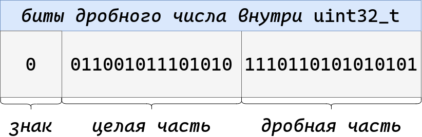

# Числа с фиксированной точкой

Один из вриантов представления рациональных чисел --- зафиксировать длину
целой и дробной части в битах. После этого можно хранить отдельно целую, дробную
часть и знак, --- либо вообще все запаковать в один инт.

Преимущество таких чисел --- всегда будет ровно указанная точность. Поэтому их
используют, чтобы считать деньги или еще что-то важное. Такой [тип
данных](https://www.postgresql.org/docs/current/datatype-numeric.html#DATATYPE-NUMERIC-DECIMAL)
есть практически во всех БД. Однако применять его не всегда удобно, потому что
1. Диапазон значений не очень большой. На картинке выше я потратил 16 бит на
   дробную часть и еще один бит на знак. После этого целая часть 15-битная,
   значит, число будет лежать лишь в пределах 32k по модулю. А уменьшать
   дробную часть не хочется, потому что потеряем точность.
1. В коде потребовался бы тип `decimal<N, K>` с указанием длины целой и дробной
   части. Такие типы пришлось бы везде явно прописывать и мучительно кастовать,
   если они немного не совпадают. После арифметических действий `N` и `K`
   изменялись бы --- не всегда к очевидными значениям --- чтобы итоговый тип
   гарантированно мог вместить результат операции.

Поэтому хотелось бы иметь универсальный тип, который может одновременно хранить
и достаточно большие, и достаточно точные значения.
