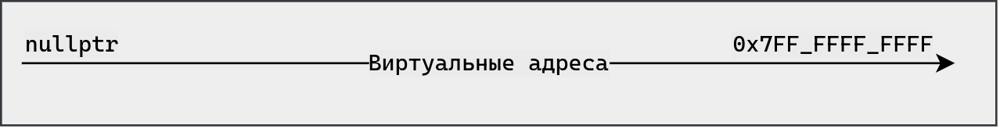
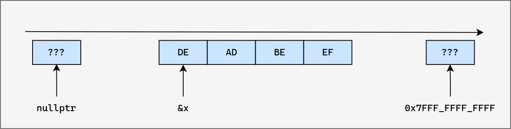
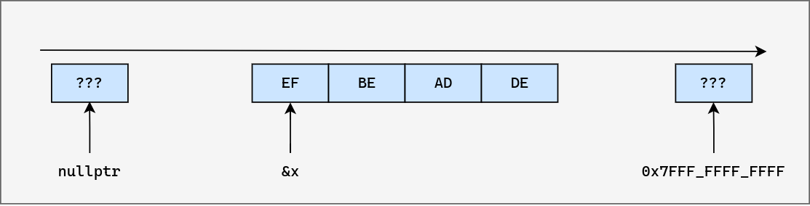
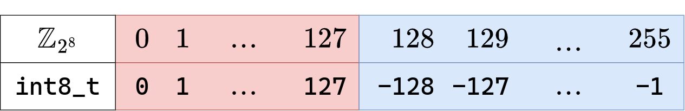

# Беззнаковые инты

С беззнаковыми интами все просто. Биты представления в памяти &mdash; это цифры
числа в двоичной системе счисления. Все вычисления над такими интами происходят
в кольце \\( \mathbb{Z}_{2^k} \\), где \\( k \\) &mdash; длина числа в битах.
Единственная неоднозначность &mdash; это
[endianness](https://en.wikipedia.org/wiki/Endianness), или порядок байт.

# Endianness

Традиционно есть два способа хранения беззнаковых интов: big endian и little
endian. Big endian &mdash; это обычная запись в двоичной системе счисления:
сначала идут старшие разряды, потом младшие. В little endian байты числа (именно
байты, не биты) расставлены задом наперед: сначала младшие, потом старшие.

Посмотрим на примере `uint32_t x = 0xDEADBEEF`. Договоримся, что адреса в памяти
идут слева направо.

Представление в big endian будет
такое.

В little endian наоборот.

Мне little endian кажется логичнее, потому что `&x` &mdash; адрес младшего
байта числа, это как-то более ожидаемо.

Выбор конкретного endianness зависит от архитектуры процессора, т.к. будут
по-разному работать арифметические операции на уровне железа. В большинстве
современных архитектур используется little endian.

По историческим причинам big endian применяют в сетевых протоколах. Например, в
TCP номера портов в
[хедере](https://en.wikipedia.org/wiki/Transmission_Control_Protocol#TCP_segment_structure)
закодированы в big endian, и надо их конвертировать в little endian, чтобы
получить понятное представление. Поэтому big endian еще называется сетевым
порядком байт.

> Название endianness шуточное. В "Путешествиях Гулливера" в Лиллипутии была
> война между тупоконечниками (big endians) и остроконечниками (little endians)
> &mdash; они спорили, с какой стороны лучше разбивать яйца. В акосе то же
> самое, только little endian объективно лучше.

> Понятие endianness применимо не только к беззнаковым интам, но и вообще к
> любым структурам, в которых несколько байт. Например, к флоатам или символам в
> UTF-16. Для флоатов тоже обычно используется little endian, а в начале
> UTF-16-файлов явно указывается порядок байт.

# Знаковые инты

Есть несколько способов представления знаковых интов. Наиболее популярный
&mdash; [two's complement](https://en.wikipedia.org/wiki/Two%27s_complement),
про который рассказано ниже.

Мы продолжим работать с кольцом \\( \mathbb{Z}_{2^k} \\), но "переобозначим" его
элементы, чтобы получить знаковые инты. Первая половина будет считаться
неотрицательной, а вторая отрицательной. Для 8-битных чисел получится так.

Здесь отрицательных чисел больше чем положительных, потому что у `-128` нет
пары. Такой способ кодирования хорош тем, что можно реализовать операции над
знаковыми интами точно так же, как над беззнаковыми.

Пусть \\( \\mathrm{repr}(x) \\) &mdash; представление \\( k \\)-битного
знакового инта \\( x \\) в \\( \mathbb{Z}_{2^k} \\). Тогда в наших обозначениях
\\( \\mathrm{repr}(-x) = 2^k - \\mathrm{repr}(x) = -\\mathrm{repr}(x) \\).
Например, в 8-битном случае \\( \\mathrm{repr}(-1) = 256 - 1 = 255 \\), а \\(
\\mathrm{repr}(-127) = 256 - 127 = 129 \\). Теперь можно забыть про знаки и всю
арифметику выполнять над представлениями точно так же, как над беззнаковыми \\(
k \\)-битными интами. Например, \\( \\mathrm{repr}(x) + \\mathrm{repr}(-x) =
\\mathrm{repr}(x + (-x)) = 0 \\). В общем случае любые операторы можно заносить
внутрь \\( \\mathrm{repr} \\), пока не происходит переполнений. Переполнения
ломают такую конструкцию, поэтому в случае знаковых интов они считаются за UB.